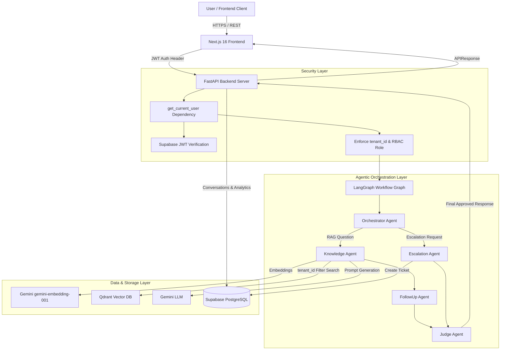
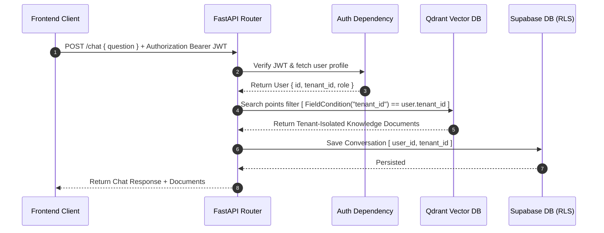

# SupportOS AI — Architecture & Multi-Tenancy Specification

## System Overview

SupportOS AI is a production-grade multi-tenant AI customer support SaaS platform built with FastAPI, Next.js 16 (App Router), LangGraph, Qdrant Vector Database, Google Gemini, and Supabase PostgreSQL.

---

## 1. High-Level System Architecture Diagram



---

## 2. Multi-Tenancy Security & Data Isolation Architecture



### Multi-Tenancy Rules
1. **Tenant Identification**: Every user belongs to a `tenant_id` stored in the `users` table.
2. **Qdrant Vector Isolation**: All Qdrant `query_points` searches strictly filter by payload `tenant_id`:
   ```python
   FieldCondition(
       key="tenant_id",
       match=MatchValue(value=str(tenant_id))
   )
   ```
3. **PostgreSQL RLS Policies**: Database tables (`conversations`, `tickets`, `user_profiles`) restrict access via Row-Level Security policies ensuring Tenant A never accesses Tenant B data.

---

## 3. Agentic Workflow Architecture (LangGraph)

1. **Orchestrator Agent**:
   - Inspects the latest user message.
   - Evaluates escalation keywords (`human`, `agent`, `escalate`).
   - Routes request to either `escalation_agent` or `knowledge_agent`.
2. **Knowledge Agent**:
   - Loads user profile (Digital Twin) and conversation memory history.
   - Executes RAG retrieval against Qdrant.
   - Prompts Gemini to generate grounded answer.
3. **Escalation Agent**:
   - Automatically creates an escalated ticket record in Supabase.
   - Generates human transfer response.
4. **FollowUp Agent**:
   - Polishes draft answer and ensures state readiness.
5. **Judge Agent**:
   - Validates response quality, formatting, and safety before releasing to API response.
